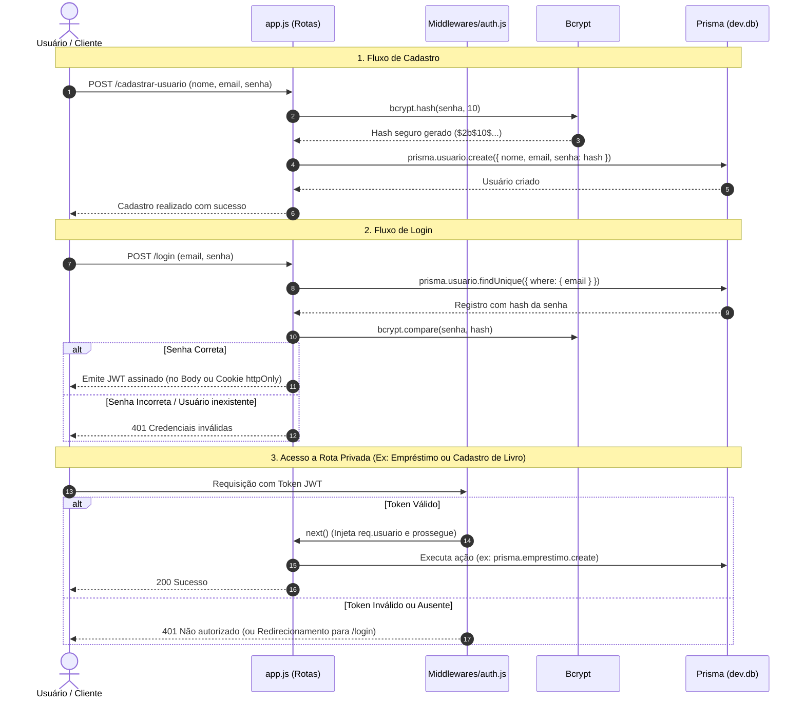

# simulador_biblioteca
# Simulador de Biblioteca - Guia de Autenticação (Bcrypt & JWT)

Este documento contém o guia completo e detalhado sobre como implementar autenticação segura utilizando **Bcrypt** para hash de senhas, **JSON Web Token (JWT)** para emissão/validação de tokens e **Middlewares** para proteção de rotas privadas no projeto.

---

## 📑 Sumário
1. [Visão Geral do Fluxo](#-visão-geral-do-fluxo)
2. [Estrutura de Arquivos](#-estrutura-de-arquivos)
3. [Diagrama de Funcionamento](#-diagrama-de-funcionamento)
4. [Passo a Passo de Implementação](#-passo-a-passo-de-implementação)
   - [Passo 1: Instalação das Dependências](#passo-1-instalação-das-dependências)
   - [Passo 2: Atualização do Banco com Prisma](#passo-2-atualização-do-banco-com-prisma)
   - [Passo 3: Hasheando Senhas com Bcrypt (Cadastro)](#passo-3-hasheando-senhas-com-bcrypt-cadastro)
   - [Passo 4: Validando Senha e Gerando JWT (Login)](#passo-4-validando-senha-e-gerando-jwt-login)
   - [Passo 5: Criando o Middleware de Proteção](#passo-5-criando-o-middleware-de-proteção)
   - [Passo 6: Protegendo as Rotas Privadas](#passo-6-protegendo-as-rotas-privadas)
5. [Estratégias de Envio: Cookie HTTP-Only vs Header Bearer](#-estratégias-de-envio-cookie-http-only-vs-header-bearer)
6. [Boas Práticas de Segurança](#-boas-práticas-de-segurança)

---

## 📌 Visão Geral do Fluxo

A autenticação é dividida em três pilares fundamentais:

```
[Cadastro]  --> Hashear senha com Bcrypt (Salt + Hash) --> Salvar no banco
[Login]     --> Comparar senha digitada com Hash      --> Gerar Token JWT assinado
[Proteção]  --> Interceptar requisição (Middleware)   --> Validar JWT e liberar rota
```

1. **Cadastro:** A senha enviada pelo usuário nunca é gravada em texto puro. O `bcrypt` adiciona um *salt* aleatório e gera um *hash* unidirecional.
2. **Login:** A senha informada é comparada matematicamente contra o hash salvo no banco (`bcrypt.compare`). Se coincidir, geramos um token JWT assinado digitalmente com nossa chave secreta (`JWT_SECRET`).
3. **Rotas Privadas:** O cliente envia o token nas próximas requisições. O middleware valida o token (`jwt.verify`). Se estiver válido e não expirado, a rota é executada; caso contrário, a requisição é rejeitada com status `401 Unauthorized`.

---

## 📁 Estrutura de Arquivos

Arquitetura do projeto `biblioteca_project` indicando os arquivos envolvidos:

```text
biblioteca_project/
│
├── 📄 .env                         ✨ [NOVO] Guarda segredos (ex: JWT_SECRET)
├── 📄 package.json                 ✏️ [MODIFICADO] Adiciona dependências: bcryptjs, jsonwebtoken
├── 📄 app.js                       ✏️ [MODIFICADO] Rotas de login, cadastro com hash e proteção
├── 📄 dev.db                       📄 Banco SQLite (com nova coluna de senha)
├── 📄 seed.js                      📄 Script de povoamento inicial
│
├── 📁 lib/
│   └── 📄 prisma.js                📄 Instância do Prisma Client
│
├── 📁 Middlewares/
│   ├── 📄 logger.js                📄 Middleware de logs
│   └── 📄 auth.js                  ✨ [NOVO] Middleware que valida o JWT
│
├── 📁 prisma/
│   └── 📄 schema.prisma            ✏️ [MODIFICADO] Adiciona campo `senha String` no model Usuario
│
└── 📁 views/
    ├── 📁 css/
    │   └── 📄 style.css            📄 Folhas de estilo da aplicação
    └── 📁 html/
        ├── 📄 index.html           📄 Tela principal da biblioteca
        ├── 📄 editar-livro.html    📄 Tela de edição
        └── 📄 login.html           ✨ [NOVO] Formulário de login do usuário
```

### Papel de Cada Arquivo

| Arquivo | Função no Sistema de Autenticação |
| :--- | :--- |
| `prisma/schema.prisma` | Define a coluna `senha` na tabela `Usuario` para armazenar o hash do Bcrypt. |
| `.env` | Contém a chave secreta (`JWT_SECRET`) usada para assinar e validar a autenticidade dos tokens. |
| `Middlewares/auth.js` | Intercepta requisições a rotas privadas, extrai e verifica a validade do JWT. |
| `app.js` | Ponto central que consome o Bcrypt nas rotas de registro/login e usa o middleware nas rotas privadas. |
| `views/html/login.html` | Interface visual para o usuário submeter seu e-mail e senha. |

---

## 🔄 Diagrama de Funcionamento



---

## 🛠️ Passo a Passo de Implementação

### Passo 1: Instalação das Dependências

No diretório `biblioteca_project`, execute:

```bash
npm install bcryptjs jsonwebtoken dotenv
```

> **Por que `bcryptjs`?** O pacote `bcryptjs` é 100% JavaScript puro e não depende de compiladores C++ nativos (Python / Visual Studio Build Tools), evitando erros comuns de instalação no ambiente Windows.

Crie também um arquivo `.env` na raiz de `biblioteca_project`:

```env
JWT_SECRET=super_chave_secreta_e_longa_para_o_simulador_2026
PORT=5000
```

---

### Passo 2: Atualização do Banco com Prisma

No arquivo `prisma/schema.prisma`, adicione o campo `senha` ao modelo `Usuario`:

```prisma
model Usuario {
  id          Int          @id @default(autoincrement())
  nome        String
  email       String       @unique
  senha       String       // Campo para armazenar o hash do Bcrypt
  emprestimos Emprestimo[]
}
```

Atualize o banco de dados executando:

```bash
npx prisma db push
```

---

### Passo 3: Hasheando Senhas com Bcrypt (Cadastro)

Ao receber a senha no cadastro, geramos o hash criptográfico com fator de custo `10` (*salt rounds*):

```javascript
const bcrypt = require('bcryptjs');
const prisma = require('./lib/prisma');

app.post('/cadastrar-usuario', async (req, res) => {
  try {
    const { nome, email, senha } = req.body;

    // 1. Gera o salt e o hash da senha
    const salt = await bcrypt.genSalt(10);
    const senhaHash = await bcrypt.hash(senha, salt);

    // 2. Salva o usuário com o hash no banco (nunca a senha pura)
    await prisma.usuario.create({
      data: {
        nome,
        email,
        senha: senhaHash
      }
    });

    res.redirect('/usuarios');
  } catch (erro) {
    console.error('Erro ao cadastrar usuário:', erro);
    res.status(500).send('Erro ao cadastrar usuário');
  }
});
```

---

### Passo 4: Validando Senha e Gerando JWT (Login)

Na rota de login, comparamos a senha digitada com o hash salvo e emitimos o token JWT:

```javascript
const jwt = require('jsonwebtoken');
const bcrypt = require('bcryptjs');

const JWT_SECRET = process.env.JWT_SECRET || 'chave_padrao_segura';

app.post('/login', async (req, res) => {
  try {
    const { email, senha } = req.body;

    // 1. Procura o usuário pelo email
    const usuario = await prisma.usuario.findUnique({ where: { email } });
    if (!usuario) {
      return res.status(401).send('E-mail ou senha incorretos.');
    }

    // 2. Compara a senha em texto puro com o hash gravado
    const senhaCorreta = await bcrypt.compare(senha, usuario.senha);
    if (!senhaCorreta) {
      return res.status(401).send('E-mail ou senha incorretos.');
    }

    // 3. Gera o token JWT com dados essenciais (payload) e expiração
    const token = jwt.sign(
      { id: usuario.id, email: usuario.email, nome: usuario.nome },
      JWT_SECRET,
      { expiresIn: '8h' }
    );

    // Exemplo para APIs:
    // return res.json({ token, usuario: { id: usuario.id, nome: usuario.nome } });

    // Exemplo para páginas Web tradicionais (formulários):
    res.cookie('token', token, { httpOnly: true, maxAge: 8 * 60 * 60 * 1000 });
    res.redirect('/');
  } catch (erro) {
    console.error('Erro no login:', erro);
    res.status(500).send('Erro interno no servidor');
  }
});
```

---

### Passo 5: Criando o Middleware de Proteção

Crie o arquivo `Middlewares/auth.js`. Ele oferece suporte tanto a **Headers HTTP** (`Authorization: Bearer <token>`) quanto a **Cookies** de navegação:

```javascript
// Middlewares/auth.js
const jwt = require('jsonwebtoken');

const JWT_SECRET = process.env.JWT_SECRET || 'chave_padrao_segura';

function authMiddleware(req, res, next) {
  // 1. Tenta obter o token via Header Authorization: Bearer <token>
  let token = null;
  const authHeader = req.headers['authorization'];
  if (authHeader && authHeader.startsWith('Bearer ')) {
    token = authHeader.split(' ')[1];
  }

  // 2. Se não estiver no Header, tenta obter dos cookies (caso use cookie-parser)
  if (!token && req.cookies && req.cookies.token) {
    token = req.cookies.token;
  }

  // Se não houver token, bloqueia o acesso
  if (!token) {
    // Para requisições de API:
    if (req.headers.accept && req.headers.accept.includes('application/json')) {
      return res.status(401).json({ erro: 'Acesso negado. Token não fornecido.' });
    }
    // Para navegação web no navegador:
    return res.redirect('/login');
  }

  try {
    // 3. Valida e decodifica o token
    const decoded = jwt.verify(token, JWT_SECRET);
    
    // Injeta os dados do usuário autenticado no objeto `req`
    req.usuario = decoded;

    next(); // Permite prosseguir para a rota solicitada
  } catch (erro) {
    if (req.headers.accept && req.headers.accept.includes('application/json')) {
      return res.status(403).json({ erro: 'Token inválido ou expirado.' });
    }
    return res.redirect('/login');
  }
}

module.exports = authMiddleware;
```

---

### Passo 6: Protegendo as Rotas Privadas

Em `app.js`, importe o middleware e insira-o antes das funções das rotas que deseja proteger:

```javascript
const authMiddleware = require('./Middlewares/auth');

// Rotas protegidas (apenas usuários autenticados conseguem executar)
app.post('/cadastrar-livro', authMiddleware, async (req, res) => {
  console.log('Livro cadastrado por usuário ID:', req.usuario.id);
  // ... lógica de cadastro de livro
});

app.post('/emprestar', authMiddleware, async (req, res) => {
  // ... lógica de empréstimo
});

app.post('/devolver/:id', authMiddleware, async (req, res) => {
  // ... lógica de devolução
});

app.delete('/livros', authMiddleware, async (req, res) => {
  // ... lógica de exclusão
});
```

---

## 🌐 Estratégias de Envio: Cookie HTTP-Only vs Header Bearer

| Característica | Header `Authorization: Bearer` | Cookie `httpOnly` |
| :--- | :--- | :--- |
| **Cenário Ideal** | APIs REST, Postman, SPAs (React, Vue, Angular), Apps Mobile | Páginas HTML com formulários tradicionais (`<form method="POST">`) e EJS |
| **Envio** | Manual via código JS (`fetch`, `axios`) | Automático pelo navegador a cada requisição |
| **Segurança contra XSS** | Vulnerável se armazenado no `localStorage` | Protegido com a flag `httpOnly: true` (JavaScript não acessa o cookie) |
| **Configuração no Express** | `req.headers['authorization']` | `npm install cookie-parser` e `app.use(cookieParser())` |

---

## 🔒 Boas Práticas de Segurança

1. **Nunca salve senhas em texto puro:** Sempre utilize Bcrypt com no mínimo 10 rounds de salt.
2. **Proteja a chave `JWT_SECRET`:** Nunca commite a chave secreta em repositórios públicos. Utilize variáveis de ambiente com o arquivo `.env`.
3. **Não coloque dados sensíveis no Payload do JWT:** O payload é codificado em Base64 e pode ser lido por qualquer pessoa. Nunca inclua senhas, CPFs ou dados bancários no token.
4. **Defina expiração (`expiresIn`):** Tokens devem sempre ter tempo limite (ex: `1h`, `8h`, `1d`) para reduzir a janela de risco caso sejam interceptados.
5. **Use HTTPS em produção:** Tokens trafegados em conexões HTTP normais podem ser capturados por ataques *man-in-the-middle*.
